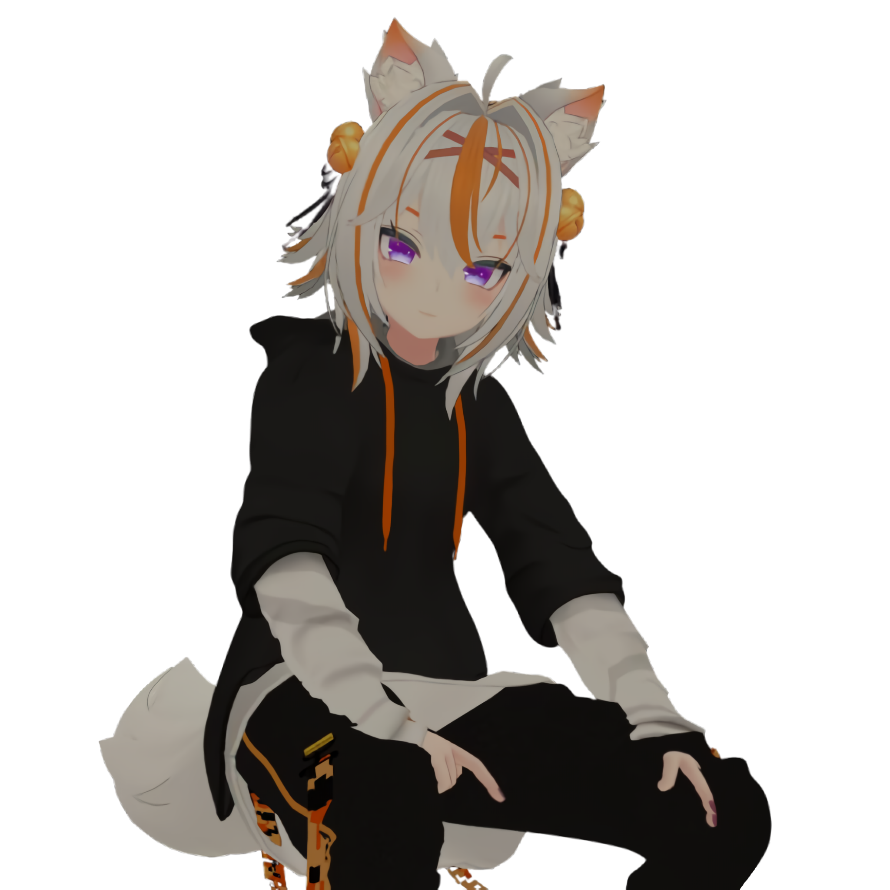

  

<h1 align="center">Hello - Henlo - Glad to see you here!</h1>

  I'm Mehrab Mahmud Udoy (Ferris)

  I'm just getting started in the world of web development. I'm excited to learn and explore what I can create.

  👀 Into Frontend Web Development - 🎧 I’m into anime-style music and chill vibes~

  🚀 Trying to learn more every day - 🤓 Feel free to ask, I’m glad if I can help 🌴

 

  

  <a
    href="https://rimehrab.github.io"
    target="_blank"
    style="
      background: linear-gradient(45deg, #ff6ec4, #7873f5);
      color: white;
      padding: 12px 28px;
      font-weight: bold;
      font-family: 'Segoe UI', Tahoma, Geneva, Verdana, sans-serif;
      border-radius: 30px;
      text-decoration: none;
      box-shadow: 0 4px 15px rgba(255, 110, 196, 0.6);
      transition: transform 0.2s ease;
      display: inline-block;
      cursor: pointer;
    "
    onmouseover="this.style.transform='scale(1.1)'"
    onmouseout="this.style.transform='scale(1)'"
  >
    ✨ Feel free to visit my site! ✨
  </a>

